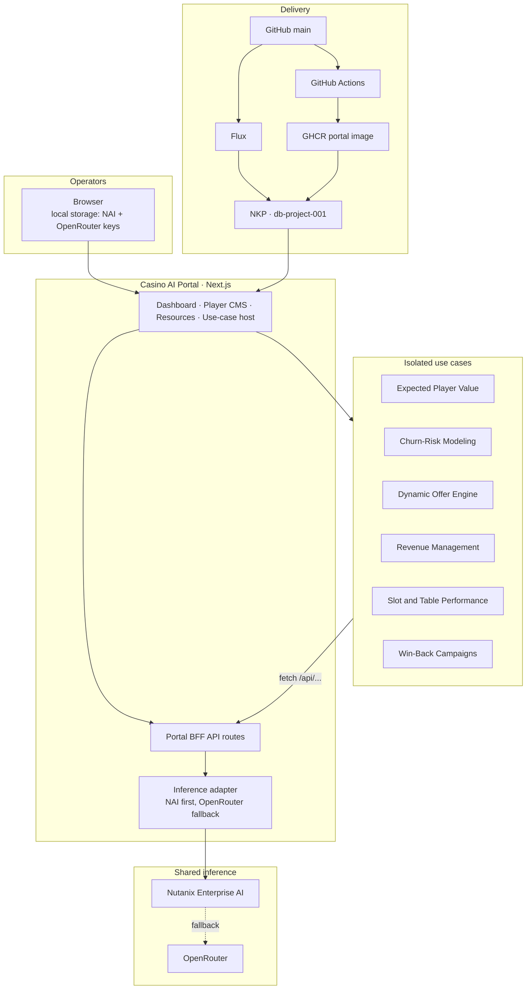

# Casino AI Use-Case Portal

A Next.js operations portal for six casino and resort AI applications. Each
use case lives in its own folder and shares infrastructure, never application
code.

Live lab deployment: [http://10.42.156.95:30007](http://10.42.156.95:30007)
(`db-project-001`, NodePort `30007`, two replicas).

```
.
├── app/                       Portal routes, dashboard, BFF API handlers
├── components/                Portal chrome (not importable by use cases)
├── lib/                       Registry, resource catalogue, inference adapter
├── shared-resources/          Shared infrastructure contracts
│   └── resources.json         Catalogue of inference gateways
├── use-cases/                 One isolated folder per application
├── deploy/gitops/             Flux overlay for NKP
├── scripts/                   Scaffolding and isolation validation
└── Dockerfile                 Portal image published to GHCR
```

## The two rules

**1. Use cases share resources, not code.** A use case never imports from a
sibling folder or from the portal's `lib/` and `components/`. Inference is
reached through portal API routes that call `lib/model-gateways.ts`.

**2. A use case is exactly one folder.** UI, synthetic data, and docs live
under `use-cases/<slug>/`. Adding one does not require a portal file change.
`npm run validate` fails the build on a cross-boundary import.

## Logical architecture



Request path for generative AI:

1. The operator saves Nutanix Enterprise AI and OpenRouter settings in the
   browser on `/resources`.
2. A use-case button posts synthetic context plus those settings to a portal
   API route.
3. The server uses the credentials only for that request. It prefers Nutanix
   Enterprise AI and falls back to OpenRouter.
4. Scores, rates, offers, and campaign membership stay deterministic. AI
   explains and recommends; it does not approve or dispatch.

## Applications

All six are interactive beta applications with synthetic data and an
inference-backed report or recommended-action control.

| Use case | Owner | Route |
| --- | --- | --- |
| Expected Player Value | Player Development | [`/use-cases/predictive-ltv-scoring`](use-cases/predictive-ltv-scoring) |
| Churn-Risk Modeling | Player Development | [`/use-cases/churn-risk-modeling`](use-cases/churn-risk-modeling) |
| Dynamic Offer Engine | Marketing Operations | [`/use-cases/dynamic-offer-engine`](use-cases/dynamic-offer-engine) |
| Revenue Management | Revenue Management | [`/use-cases/revenue-management`](use-cases/revenue-management) |
| Slot & Table Performance | Gaming Operations | [`/use-cases/slot-table-performance`](use-cases/slot-table-performance) |
| Win-Back Campaigns | Marketing Operations | [`/use-cases/win-back-campaigns`](use-cases/win-back-campaigns) |

Design notes for each application: `use-cases/<slug>/DESIGN.md`.
Portfolio design: [`docs/casino-uc-design.md`](docs/casino-uc-design.md).

## Player CMS

Patron identity is a portal surface, not a seventh AI use case. `/cms` is a
synthetic SYNKROS-shaped player book: names, contact, host, card, visits, comps,
and responsible-gaming flags. Use-case queues keep display labels only and link
into `/cms/players/<id>`. Host notes stay in browser local storage because the
lab runs two portal replicas.

Look up IDs from Expected Player Value (`100100+`), churn (`200100+`), offers
(`300200+`), and win-back (`410000+`). Self-excluded and marketing-suppressed
records are visible in CMS and must not be used for outreach.

Optional host briefings use the same Nutanix Enterprise AI then OpenRouter path
as the applications.

## Shared resources

The catalogue in [`shared-resources/resources.json`](shared-resources/resources.json)
currently declares two inference gateways:

| Resource | Role | Docs |
| --- | --- | --- |
| Nutanix Enterprise AI | Primary OpenAI-compatible inference | [`shared-resources/nutanix-enterprise-ai/`](shared-resources/nutanix-enterprise-ai/README.md) |
| OpenRouter | Fallback hosted inference | [`shared-resources/openrouter/`](shared-resources/openrouter/README.md) |

Keys, endpoints, and selected models are stored in the browser, not in a
Kubernetes Secret. The portal uses them transiently. This lab has no TLS or
login; use HTTPS before taking the pattern outside the isolated environment.

## Getting started

```bash
npm install
npm run dev
```

Open http://localhost:3000. Configure inference on `/resources`, then generate
a briefing or recommended action from any application.

## Adding a use case

```bash
npm run new:use-case incident-triage
```

The dashboard discovers `use-cases/*/usecase.json`. Folders starting with `_`
or `.` are ignored. Details: [`use-cases/README.md`](use-cases/README.md).

## Scripts

| Command | Purpose |
| --- | --- |
| `npm run dev` | Portal with hot reload |
| `npm run build` | Production build |
| `npm run typecheck` | TypeScript, no emit |
| `npm run validate` | Enforce the isolation contract |
| `npm run new:use-case <slug>` | Scaffold from `_template/` |

## Deploying

The live path is GitOps:

1. Push to `main`.
2. GitHub Actions publishes `ghcr.io/script-repo/ucdemo-001-casino/portal`.
3. The workflow writes an immutable `sha-<commit>` tag into
   `deploy/gitops/db-project-001/kustomization.yaml`.
4. Flux reconciles the overlay into `db-project-001`.

See [`deploy/gitops/README.md`](deploy/gitops/README.md).
