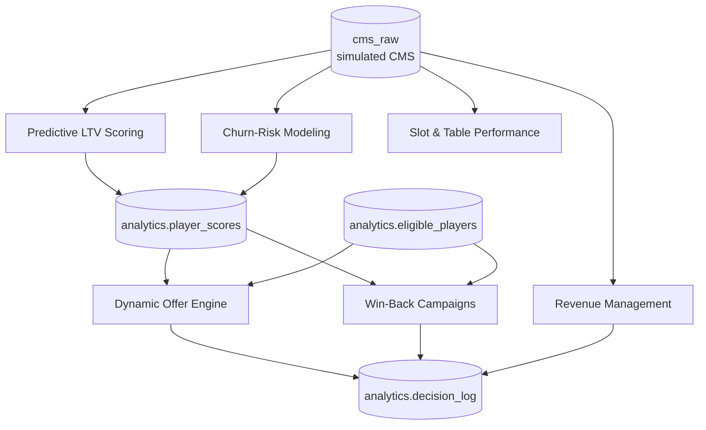

# Casino AI Portfolio — Design

Design anchor for the six casino use cases. `docs/casino-scope.md` records *what*
was agreed; this document records *how* it fits together. Each use case then has
its own `DESIGN.md` covering its outcomes, contracts, infrastructure, UI, flows,
and API.

Read this first. The per-use-case documents assume the shared objects, naming,
and constraints defined here and do not restate them.

---

## 1. Portfolio principles

These are binding on all six. A use case that cannot meet one of them needs the
principle revisited, not a local exception.

**1. Recommend only.** No use case dispatches anything to a player without human
approval. This is a constraint on the interface — there is no "auto-send" flag to
turn on later. Every recommendation surface is an approval queue.

**2. The responsible gaming gate filters before display.** A suppressed player
must never appear in an approval queue, not merely be blocked at send. Filtering
at send time means a marketer has already read the name, which is the harm the
gate exists to prevent.

**3. Contracts, not shared code.** The portal forbids imports between use cases.
Cross-cutting concerns therefore ship as database objects and HTTP endpoints:
`analytics.player_scores`, `analytics.eligible_players`, `analytics.decision_log`.
The schema is the contract; each use case writes its own small client against it.
Duplicated three-line clients are the intended cost.

**4. Every decision is reconstructible.** State auditability means an auditor can
take any recommendation and recover the model version, the input features, the
responsible-gaming result, and the reviewer's outcome. That is one row in
`analytics.decision_log` plus one MLflow run id.

**5. Explanations are generated, scores are not.** Enterprise AI writes the prose
that explains a score or a recommendation. It never produces the number. A
narrative layer that could change a score would put an unauditable model inside a
regulated decision path.

**6. Degrade rather than fail.** Where a dependency is optional — narrative text
above all — the use case must work without it and say so in the interface. See
§5 for why this is currently more than theoretical.

**7. Calibrate against a named baseline.** Every predictive use case states the
baseline it must beat before pilot is called complete. "The model works" is not
an exit criterion; "the model beats a fixed 90-day window on precision at the top
decile" is.

---

## 2. Shared platform

One Postgres, one model registry, one inference endpoint, one runtime.

| Component | Where it runs | Address |
| --- | --- | --- |
| Casino Postgres (+ `pgvector`) | NKP, namespace `casino-ai-portal` | `casino-postgres.casino-ai-portal.svc.cluster.local:5432` |
| MLflow tracking + registry | NKP, same namespace | `mlflow.casino-ai-portal.svc.cluster.local:5000` |
| OpenRouter gateway | External, reachable from cluster | `OPENROUTER_BASE_URL` — chat, embeddings, rerank |
| Nutanix Enterprise AI | External, **not** reachable from cluster | `NAI_ENDPOINT`, chat only |
| Portal (dashboard + all UIs) | NKP, same namespace | `ai-portal`, NodePort 30007 |
| Use-case backend | NKP, one Deployment each | `<slug>.casino-ai-portal.svc.cluster.local` |

### 2.1 Database layout

Three schemas in one database. Splitting them across databases would buy
isolation the portfolio does not need and cost joins it does.

- **`cms_raw`** — the simulated CMS source of record, modelled on what SYNKROS
  and IGT Advantage have in common. Read-only to every use case. Tables:
  `patron`, `player_card`, `card_session`, `slot_play`, `table_rating`, `trip`,
  `hotel_stay`, `fnb_transaction`, `comp_offer`, `exclusion_list`.
- **`analytics`** — the shared contract surface. Owned jointly, changed only by
  agreement. Contains the three objects in §3.
- **`uc_<slug>`** — one private schema per use case for anything it computes for
  itself. A use case needing extra signal builds it here, never as a column on a
  shared table.

### 2.2 Model lifecycle

Training runs as a Kubernetes `Job`, scoring as a `CronJob`, serving as a
long-lived FastAPI `Deployment`. Each use case owns all three; nothing is shared
but the registry.

MLflow holds experiments, model versions, and lineage. The `model_version`
written to `player_scores` and `decision_log` is the MLflow run id, which is what
makes principle 4 work.

---

## 3. Shared contracts

### 3.1 The score contract

Predictive LTV and churn-risk **write** it. The offer engine and win-back
**read** it. Freezing this in week one is what lets all six proceed in parallel:
downstream use cases build against a seeded stub.

```sql
CREATE TABLE analytics.player_scores (
    player_id                BIGINT        NOT NULL,
    score_date               DATE          NOT NULL,
    ltv_12m_theo             NUMERIC(12,2) NOT NULL,  -- predicted 12-month theo + non-gaming
    ltv_percentile           SMALLINT      NOT NULL,  -- 0-100, within property
    churn_risk               NUMERIC(4,3)  NOT NULL,  -- 0.000-1.000
    churn_band               TEXT          NOT NULL,  -- low | medium | high
    expected_days_to_visit   SMALLINT,
    model_version            TEXT          NOT NULL,  -- MLflow run id
    scored_at                TIMESTAMPTZ   NOT NULL,
    PRIMARY KEY (player_id, score_date)
);
```

**No use case may add a column here.** Two producers write disjoint column sets
into the same row, so the nightly scoring order is: LTV first, churn second, each
an `INSERT ... ON CONFLICT (player_id, score_date) DO UPDATE` touching only its
own columns.

### 3.2 The responsible gaming gate

A view, because a view cannot be forgotten the way a function call can.

```sql
CREATE VIEW analytics.eligible_players AS
SELECT p.player_id
FROM cms_raw.patron p
LEFT JOIN cms_raw.exclusion_list e
       ON e.player_id = p.player_id
      AND e.active
WHERE e.player_id IS NULL
  AND p.marketing_opt_in;
```

Player-facing use cases (offer engine, win-back) **join** against this view when
building a candidate list. They do not fetch a list and filter it in application
code — an inner join cannot be skipped by a code path that forgot to check.

### 3.3 The decision log

One row per recommendation, written when the recommendation is *created*, updated
when it is reviewed.

```sql
CREATE TABLE analytics.decision_log (
    decision_id     BIGSERIAL     PRIMARY KEY,
    use_case        TEXT          NOT NULL,  -- portal slug
    subject_type    TEXT          NOT NULL,  -- player | unit | rate_date
    subject_id      TEXT          NOT NULL,
    recommendation  JSONB         NOT NULL,
    features        JSONB         NOT NULL,  -- inputs as seen at decision time
    model_version   TEXT,                    -- MLflow run id, null for rule-based
    rg_gate_result  TEXT          NOT NULL,  -- pass | suppressed | not_applicable
    reviewer        TEXT,
    review_outcome  TEXT,                    -- pending | approved | rejected | edited
    review_reason   TEXT,
    created_at      TIMESTAMPTZ   NOT NULL DEFAULT now(),
    reviewed_at     TIMESTAMPTZ
);
```

`features` is a snapshot, not a reference. Recomputing inputs at audit time would
give the auditor today's data, not the data the model saw.

---

## 4. Dependency map



| Use case | Reads | Writes | Blocked by |
| --- | --- | --- | --- |
| Predictive LTV scoring | `cms_raw` | `player_scores` (LTV columns) | Simulator |
| Churn-risk modeling | `cms_raw` | `player_scores` (churn columns) | Simulator |
| Dynamic offer engine | `player_scores`, `eligible_players` | `decision_log` | Score contract (stub is enough) |
| Win-back campaigns | `player_scores`, `eligible_players` | `decision_log` | Score contract (stub is enough) |
| Slot & table performance | `cms_raw` | — | Nothing |
| Revenue management | `cms_raw`, LTV **aggregate** | `decision_log` | Nothing |

Revenue management deliberately consumes an *aggregate* — expected high-value
arrivals for a date — rather than per-player scores. Coupling hotel pricing to
the per-player contract would make a hotel-side forecast wait on player scoring
for no forecasting benefit.

**Critical path:** the simulator. Two use cases are blocked outright by it and
two more are blocked on the scores it enables. Slot & table performance and
win-back's interface work are the only things that can start before it lands.

---

## 5. Inference and retrieval

Two gateways, and the choice between them is settled by one measured fact.

| | Nutanix Enterprise AI | OpenRouter |
| --- | --- | --- |
| Reachable from NKP | **No** | **Yes** — 280 ms, verified from a pod |
| Chat | `nemotron3-fp4-uni` | `nemotron-3-super-120b-a12b:free`, `nemotron-3-nano-omni-30b-a3b-reasoning:free` |
| Embeddings | none published | `nemotron-3-embed-1b:free`, 2048 dims |
| Rerank | none | `llama-nemotron-rerank-vl-1b-v2:free` |

**The backends target OpenRouter.** Enterprise AI stays registered and
configured for workstation use, and becomes the preferred gateway the moment
cluster egress to it is opened — the adapter below makes that a configuration
change, not a rewrite.

This supersedes the earlier local-first position. Retrieval and inference both
run in-cluster; there is no reason to keep the portal on a workstation.

### 5.1 The narrative adapter

Still two implementations behind one interface, but now for a better reason than
a missing route:

1. **Model-backed** — the configured gateway.
2. **Template-backed** — deterministic sentences from the same features.

Selection is by reachability *and quota* at call time, and the interface labels
which produced the text. Principle 6 wants this independently: a regulated
approval queue must not stop working because an external endpoint is slow, and
with a hard daily request cap (§5.3) exhaustion is a routine event, not an
outage.

### 5.2 Retrieval, and where it earns its place

The casino analyses are relational. Scores, cadence baselines, peer groups, and
forecasts are aggregate queries over structured data, and vector search helps
none of them. Retrieval is **not** a substitute for a SQL query, and no use case
should embed player records.

What retrieval is for is **grounding the narrative layer in property
documents**: responsible gaming policy, comp matrices, game rules, standard
operating procedures, and the metric dictionary behind natural-language
querying. A rationale sentence that cites the comp matrix is defensible; one the
model invented is not.

The pattern is retrieve-then-rerank, two gateway calls per question:

1. Vector search in the use case's own `uc_<slug>.doc_chunk` table, over-fetching
   to roughly 30 candidates.
2. `POST /rerank` over those candidates with the original question.
3. Keep the top 5 **by rank order**. Rerank scores are relative, not calibrated
   probabilities, so an absolute threshold means nothing.

Chunk tables live in each use case's own schema. Retrieval is not a shared
service; the embedding client is a dozen lines each use case vendors itself.

**Embeddings are 2048-dimensional and the model rejects any other width.** That
exceeds pgvector's 2000-dimension index ceiling, so indexes are built on a
`halfvec` cast — see
[`shared-resources/vector-db/README.md`](../shared-resources/vector-db/README.md).
Getting this wrong produces a table that cannot be indexed at all.

### 5.3 Two constraints that shape the design

**Reasoning tokens are billed against `max_tokens`.** Both chat models return a
separate `reasoning` field. Measured on the same prompt: at `max_tokens` 64 the
response came back `finish_reason: length`, truncated inside the trace; at 256
and 1024 it completed. Budget 1536. Log the `reasoning` field for audit, never
display it.

**`:free` variants are capped account-wide at 50 requests per day**, 20 per
minute, until $10 of lifetime credits raises it to 1,000. The cap counts
requests, not tokens, and failed requests count too.

Three consequences, all of them design-visible:

- **Batch embeddings.** One request accepts 256 inputs (measured: 4.4 seconds),
  so a day's quota is roughly 12,800 chunks. Corpus ingestion is a job, not a
  per-request operation.
- **Narrative is per-band, not per-player.** Win-back generates copy for three
  offer bands, not for 2,180 candidates — which the review requirement demanded
  anyway (a per-player narrative is unreviewable), and which the quota now makes
  mandatory rather than merely sensible.
- **Interactive retrieval is rationed.** Two requests per question against 50 a
  day means natural-language querying is a demonstration feature until the cap
  is raised.

The chat models have paid variants with no request cap. The **embedding model
does not** — `nvidia/nemotron-3-embed-1b` without the `:free` suffix returns
`404`. Raising the daily cap is therefore the only lever on the retrieval path.

---

## 6. Outcomes

| Use case | Primary user | Decision it changes | Measured by |
| --- | --- | --- | --- |
| Predictive LTV scoring | Player development | How much to reinvest in a player | Calibration within 15% by decile |
| Churn-risk modeling | Casino host | Who to contact before they lapse | Precision at top risk decile vs 90-day baseline |
| Dynamic offer engine | Marketing ops | Which offer to propose during a visit | Proposal within 2 minutes; zero suppressed players surfaced |
| Win-back campaigns | Marketing manager | Who to target for reactivation | Full review-to-audit trail on every candidate |
| Slot & table performance | Slot manager | Where to place a machine and which themes to buy | Underperformers identifiable by placement and theme |
| Revenue management | Revenue manager | Tonight's room rate | Forecast MAPE vs same-period-last-year |

None of these is "accuracy". Each is the operational decision the model exists to
improve, which is what pilot review should test.

---

## 7. Non-functional requirements

**Latency.** Near real time means minutes, within the visit. Only the offer
engine has a hard bound: two minutes from trigger event to a proposal on screen.
Everything else is nightly batch and has no interactive latency requirement
beyond a responsive UI over precomputed tables.

**Scale.** ~50,000 carded players, ~800 slot units, ~20 tables, ~300 rooms, 24
months of history. This is small. Nightly full rescoring of every player is
cheaper to build and easier to audit than incremental scoring, and at this volume
costs nothing.

**Availability.** Batch use cases tolerate a missed night; the interface shows
score staleness rather than hiding it. The offer engine is the only surface where
being down during opening hours is a real operational loss.

**Security.** Backends read credentials from the `shared-resources` Secret via
`envFrom`. No use case reads another's schema. Secret *values* are never rendered
— the portal displays only whether a variable is set.

---

## 8. Interface conventions

Consistency across six surfaces matters more than local optimisation, because the
same host may use three of them in a shift.

- **Approval queues look the same.** Subject, recommendation, reason, expected
  value, and the four actions: approve, edit, reject, skip.
- **Every score is accompanied by its drivers.** A number a host cannot explain
  to a player is a number the host will stop using.
- **Staleness is always visible.** Every scored surface shows `scored_at` and
  the model version. A stale score presented as current is worse than no score.
- **Model or template is labelled** wherever generated prose appears (§5).
- Brand Mode tokens from `app/globals.css`; use-case UIs import nothing from the
  portal shell.

---

## 9. Build order

1. **Week one.** Freeze §3. Stand up Postgres, create `cms_raw`, seed
   `player_scores` with stubbed values, create the view and the log table.
2. **Simulator.** The gating deliverable. Until it produces cadence decay ahead
   of absence and a placement/theme/performance correlation, churn and floor
   analytics have nothing learnable in them.
3. **In parallel.** LTV and churn replace the stub; offer engine and win-back
   build against it; floor and revenue management proceed independently.

---

## 10. Open items

Carried from `docs/casino-scope.md`, still unanswered, each now attached to the
use case it blocks:

| Open item | Blocks | Consequence if unresolved |
| --- | --- | --- |
| Trigger events during a visit | Dynamic offer engine | No definition of "near real time" to build against |
| Reinvestment budget rules | Dynamic offer engine | Proposals cannot state expected reinvestment against a cap |
| Approval workflow ownership | Offer engine, win-back | Unclear whether the portal is the system of record or a feeder |
| Event calendar | Revenue management | A major forecast input is missing |
| Audit log retention | All | Retention policy for `decision_log` undefined |

Owners are unassigned across all six. That is the first item to resolve, because
every exit criterion above names a role that has to accept the result.
